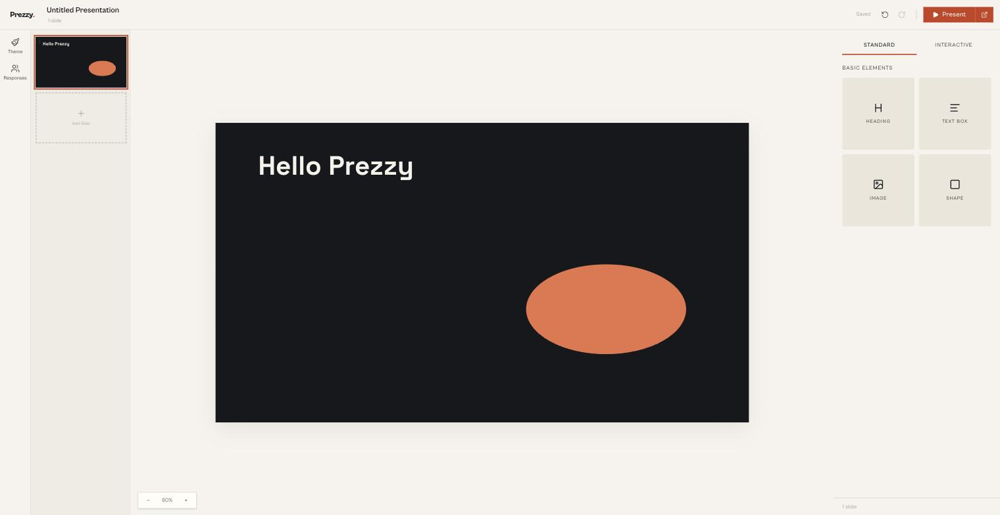

# Prezzy

[](https://github.com/ArifKobel/Prezzy/actions/workflows/ci.yml)

Prezzy is a web app for building and presenting interactive slide decks. Slides are edited on a collaborative drag-and-drop canvas, and during a presentation the audience can join via QR code to answer live quizzes and word clouds from their phones.




## Features

- Slide editor with text, images, shapes, layout presets, undo/redo and per-presentation themes (colors + fonts)
- Real-time collaboration: multiple people can edit the same deck and see each other's cursors, selections and current slide
- Live quizzes with timers, scoring and a leaderboard
- Word clouds built from audience answers in real time
- Presenter mode with fullscreen slides and live response counts
- Audience join flow via QR code / join code, no account needed

## Stack

- React with TanStack Router/Start and TanStack Query, Tailwind CSS
- NestJS API with Drizzle ORM on Postgres
- Yjs for collaborative editing, socket.io as the transport and for audience updates
- pnpm workspaces + Turborepo, Biome for linting

## How editing works

The editor does not talk to REST endpoints. Each presentation is a Yjs document: slides, elements, title and theme all live in one CRDT that the browser edits locally, so every interaction is instant and undo/redo falls out of `Y.UndoManager`. The API keeps an authoritative copy of each open document in memory and syncs it with all connected editors over socket.io using the standard y-protocols sync and awareness messages. Conflicts between concurrent editors are resolved by the CRDT itself, and presence (cursors, selections, active slide) rides on the same connection via the awareness protocol.

The server persists the document as an update blob and, debounced, materializes it back into ordinary `slides` and `slide_elements` rows. Presenter mode, the audience views and the dashboard read those rows over plain REST, so they stay decoupled from the CRDT. Decks that existed before a document was ever opened are hydrated from their rows on first connect.

The editor core (`apps/web/src/lib/editor`) is plain TypeScript with no React in it: document schema, commands, an interaction state machine and a selection store, each with unit tests. React binds to it through a thin `useSyncExternalStore` layer.

## Setup

```bash
pnpm install
pnpm run db:up      # starts Postgres via docker compose
pnpm run db:push    # creates the tables
pnpm run dev        # web on :3000, api on :3001
```

Environment files: `apps/api/.env` (database url, jwt secret, port, web origin) and `apps/web/.env` (`VITE_API_URL`). Both ship with working defaults for local development, see the `.env.example` files.

## Repo layout

```
apps/web              frontend (routes, editor, presenter, audience views)
apps/api              nestjs api (rest, yjs collab gateway, drizzle schema)
packages/shared       types shared between web and api
packages/ui           shared UI components
packages/env          typed env handling
packages/config       shared tsconfig
```

## Testing

- `pnpm run test` - unit tests (editor core), API integration tests against a real Postgres, and browser tests via Playwright
- `pnpm -F web test` / `pnpm -F api test` - just one side; the API tests need the Postgres container running
- `pnpm run lint` - Biome
- `pnpm run check-types` - type checking across the workspace

## Scripts

- `pnpm run dev` - run web and api in dev mode
- `pnpm run dev:web` / `pnpm run dev:api` - only one of them
- `pnpm run db:up` / `pnpm run db:down` - start or stop the Postgres container
- `pnpm run db:push` - sync the Drizzle schema to the database
- `pnpm run build` - build all packages

## Contributing

See [CONTRIBUTING.md](CONTRIBUTING.md) for the workflow and commit convention.
